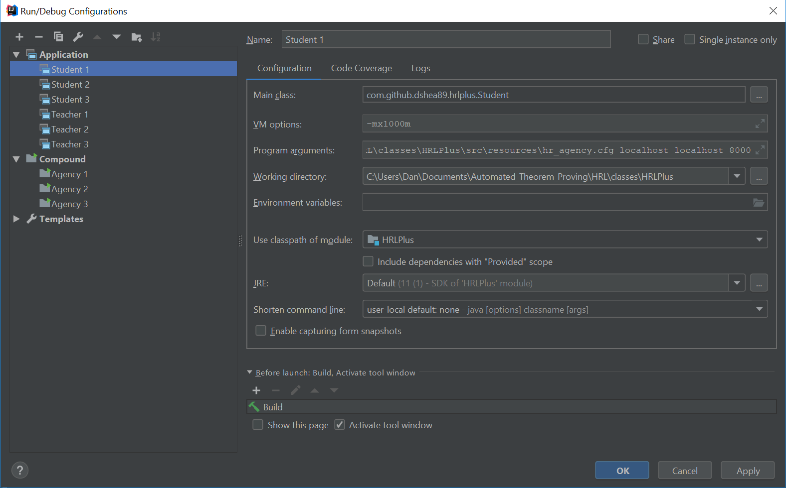
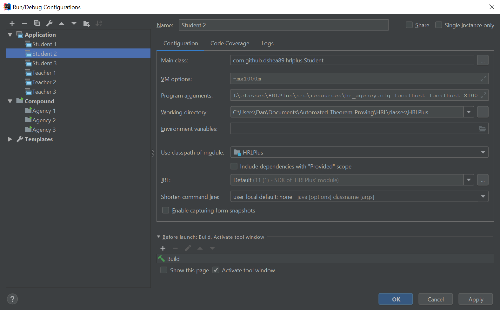
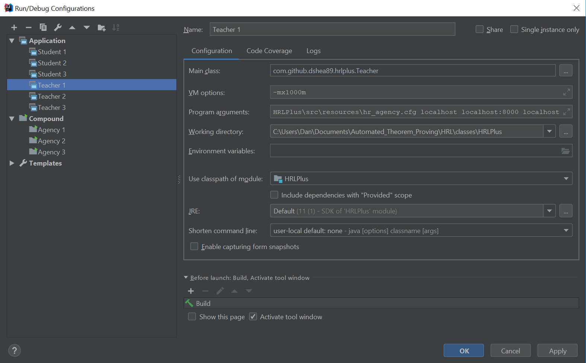
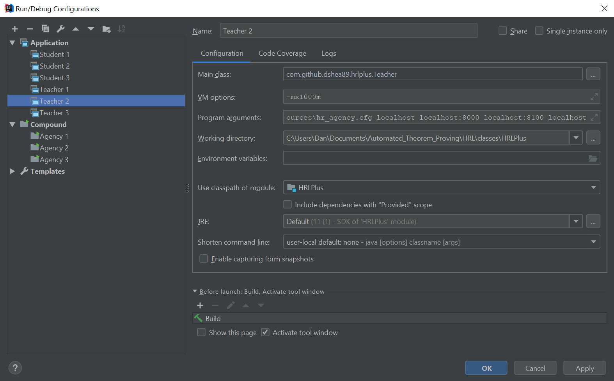
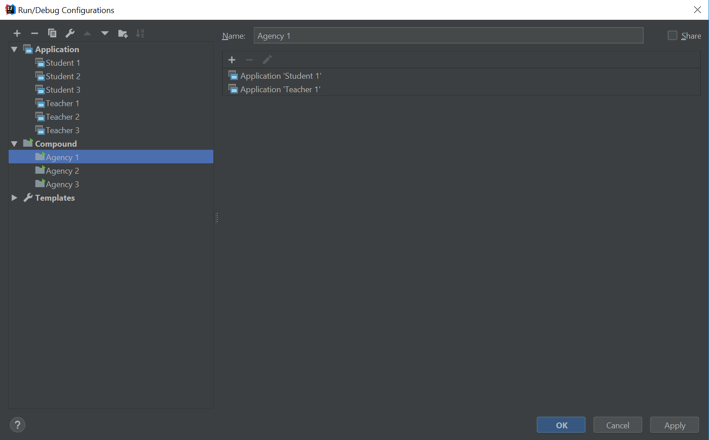
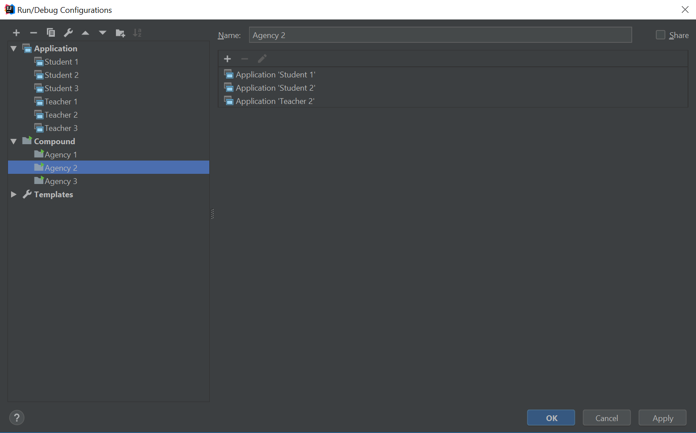
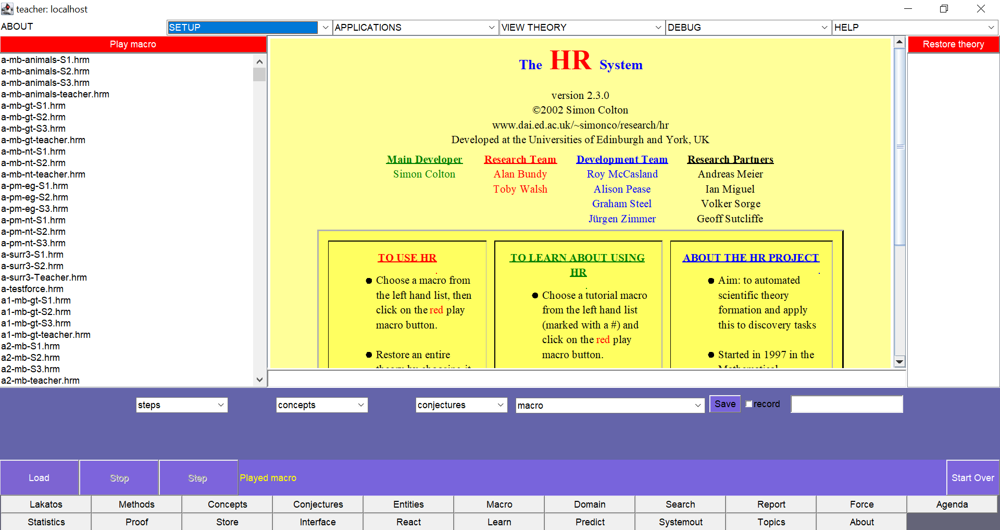

# HRL Plus

The system **HRL** incorporates Simon Colton's program [**HR**](https://web.archive.org/web/20120930024411/http://www.doc.ic.ac.uk/~sgc/hr/index.html), which is named after mathematicians Godfrey Harold Hardy (1877 - 1947) and Srinivasa Aiyangar Ramanujan (1887 - 1920), and extends it by modeling Lakatos's methods and enabling dialogue between multiple copies of **HR**. Thus, the name **HRL** reflects its debt to **HR**, and highlights the importance of the philosopher Imre Lakatos (1922 - 1974) and the deep influence of his work on the system.

The original code for this project appears to have been lost to the sands of time. Java class files were located and have been decompiled here, with some bug fixes and feature extensions made for ease of use. Hence, **HRL Plus**.

## Background

HRLPlus, and HRL itself, are built on top of HR. For more details about HR, see `HR_Background.md` in this repository.

**HRL** was developed for the following PhD thesis:

Pease, Alison. (2007). A Computational Model of Lakatos-style Reasoning.
<https://www.researchgate.net/publication/242403451_A_Computational_Model_of_Lakatos-style_Reasoning>

From the archived web page discussing the project:
<https://web.archive.org/web/20161127071833/http://homepages.inf.ed.ac.uk/apease/research/phd.html>

In his book *Proofs and Refutations*, Lakatos identifies seven methods by which mathematical discovery and justification can occur. These methods suggest ways in which concept definitions, conjectures and proofs gradually evolve via interaction between mathematicians. Different mathematicians may have different interpretations of a conjecture, examples or counterexamples of it, and beliefs regarding its value or theoremhood. Through discussion, concepts are refined and conjectures and proofs modified. For instance, when a counterexample is found, one might look for general properties which make it fail a conjecture, and then modify the conjecture by excluding that type of counterexample (piecemeal exclusion). Alternatively, one might generalise from the positives and then limit the conjecture to examples of that type (strategic withdrawal). Another reaction might be to deny that the object is a counterexample on the grounds that the conjecture refers to objects of a different type (monster barring). Given a faulty proof, a counterexample may be used to highlight areas of weakness in the proof, and to either modify the proof or the conjecture which it purports to prove (lemma incorporation).

Our main aim was to provide a computational reading of Lakatos's theory, by interpreting it as a series of algorithms and implementing these algorithms as a computer program. We hypothesised that this is *(a)* possible, and *(b)* useful. In order to test our hypotheses we developed a system within which we implemented his methods: **HRL**. This is a multi-agent automated theory formation programme in which each agent has a copy of Colton's theory formation system **HR**, which can form concepts and make conjectures which empirically hold for the objects of interest supplied. The conjectures are communicated to the other agents, who send counterexamples if they have them. Agents then use Lakatos's methods to suggest modifications to conjectures, concept definitions and proofs.

The following people were involved with the project:

Alan Smaill -- supervisor (A.Smaill \_AT\_ ed.ac.uk)  
John Lee -- co-supervisor (J.Lee \_AT\_ ed.ac.uk)  
Simon Colton -- co-supervisor (sgc \_AT\_ doc.ic.ac.uk)  
Alison Pease -- PhD student (A.Pease \_AT\_ sms.ed.ac.uk)  

This work was supported by EPSRC grant GR/M45030

## Motivation

The fields of automated theorem generation and automated theorem proving are quite fascinating. Much of the work that has been done in this field is closed-source and, while written about extensively in academic publications, either does not offer much in the way of open-source code or is quite tedious to set up.

**HRL** is a counterexample to this trend, in which the code had been made available prior. Over time, however, the pages hosting these projects have disappeared, only accessible in some form via the Internet Archive Wayback Machine, and even then with only limited success.

This repository seeks to provide a stable location for this large-scale project. As this code is built off of decompiled class files from a prior build of HRL, local variable names and comments have been lost. In the near future, more documentation will be provided in the way of features offered and how to use each, and hopefully extensions to supported theorem provers like Coq and Isabelle on top of the currently supported Otter and Mace.

## How to Use

Due to the scope and breadth of this system, there will be much left out of this section at first. Ideally, detailed documentation will be provided in the future with regards to each nook and cranny of the system and how it can be used to augment conjecture generation and theorem proving. For now, instructions are provided for basic setup and execution using the provided example files.

### Configuration

A configuration file must be provided when launching students or a teacher. The default configuration file is found in `src/resources/hr_agency.cfg` and consists of a few different options:

* `input files directory`: The directory where all HRD (axiom) and HRM (macro) files are stored. This can either be a path relative to the project root or an absolute path.
* `storage directory`: If you choose to save any output files in the interface, then they will be saved here. This can either be a path relative to the project root or an absolute path.
* `operating system`: The operating system you are using. Available options are `jcu_unix`, `unix`, `windows`, `york_unix`, and `york_unix_old`.
* `width`: The width of the student and teacher windows that are displayed when launched.
* `height`: The height of the student and teacher windows that are displayed when launched.
* `default max steps`: The maximum number of steps to run before terminating when generating and reasoning about conjectures. Setting this to 0 or any negative number will indicate to run forever until manually stopped by the user.

### Launching

There are a couple different ways that **HRL** can be launched.

#### Less Ideal Approach

To launch via the existing runtime scripts, set `agency-1`, `agency-2`, `agency-3`, `agency-4`, `makestudent`, and `maketeacher` in `src/resources/` as executable, then run whichever `agency-` prefixed file you wish to launch that number of Student threads and one Teacher thread.

Note that this approach has been less reliable in my experience and may be subject to issues. You will need to change the paths in `makestudent` and `maketeacher` as well as `hr_agency.cfg` when using this approach.

#### *IDE*al Approach

This project has been structured with an IDE in mind, particularly IntelliJ IDEA. To set up each of the aforementioned agency files, several new runtime configurations will be needed: one application for each instance of Student wanted, one application for each invocation of Teacher wanted, and one compound runtime configuration for each agency instance wanted.

Your Student configurations should look like so (note the VM option of `-mx1000m`, the first program argument being the absolute path to `hr_agency.cfg`, the `localhost` arguments, and the port number as the last argument which increases by 100 with each additional Student):

Your Teacher configurations should look like so (note the VM option of `-mx1000m`, the first program argument being the absolute path to `hr_agency.cfg`, the `localhost:PORT` arguments for each Student thread wanted for the Teacher, and the final `localhost` argument):

Your compound configurations should look like so:

You may need to experiment with the `width` and `height` values in the configuration file in order to find the pair that's optimal for you. If you maximize each window, then you should see all available options:

### Interface

Launching **HRL** will set off N copies of **HR** and a teacher, which will all come up on your screen. Load the macros. You need to do this individually for each student and the teacher. For instance, if you want to run the agency with three students in animals theory, launch the `Agency 3` run time configuration or `agency-3` from the command line, and then for Student 1 click on `a-mb-animals-S1.hrm` at the top of the left hand column, for Student 2 click on `a-mb-animals-S2.hrm`, and for Student 3 click on `a-mb-animals-S3.hrm`. For the teacher, click on `a-mb-animals-teacher.hrm`. Note that you can distinguish students from the teacher via the title bar. After highlighting the .hrm file, click on the red "Play macro" button in the top left hand corner for each agent. You should see "Played macro" at the bottom of the screen. For the teacher agent click the "Start" button on the bottom left hand corner, and this will start the agency running.

During and after the run, go to the Lakatos screen by clicking on the "Lakatos" button in the bottom left hand corner. This will give you twelve tabs: up to ten students, the teacher, and the group discussion. Under the relevant tabs, type the Agent file into the yellow box: this will be `8500` for the teacher, `8000` for the first student, `8100` for the second, `8200` for the third, etc. (the address would be `8600` for a seventh student). To read the group file, type `group-file` in the Group tab. This will access the file which the students and the teacher write to during the discussion.

You can look at individual theories, for instance concepts and definitions, by clicking on the relevant button along the bottom of the screen for each student.

To end a run, click on the "Stop" button on the teacher's screen. Note that after each run, you should delete or move the files `8000`, `8100`, etc., as well as `group-file`, otherwise the old files will be read for a new run.

### Proving Deduced Conjectures

Otter and Mace are the currently supported interfaces for proving deduced conjectures as mathematical theorems.

*More details coming soon™*

## Examples

The domain files for these examples are at the top of the left hand column (just underneath the red button "Play macro").

1. (in which the platypus is barred)  
Run agency-3 or the Agency 3 IDE configuration and load the domain files:  
a-mb-animals-S1.hrm  
a-mb-animals-S2.hrm  
a-mb-animals-S3.hrm  
a-mb-animals-teacher.hrm  
in the first, second, third student and teacher, respectively.

2. (in which the students have different ideas of what constitutes a group)  
Run agency-3 or the Agency 3 IDE configuration and load the domain files:  
a-mb-gt-S1.hrm  
a-mb-gt-S2.hrm  
a-mb-gt-S3.hrm  
a-mb-teacher.hrm  
in the first, second, third student and teacher, respectively.

3. (in which Goldbach's conjecture is generated, given the main concepts in it)  
Run agency-2 or the Agency 2 IDE configuration and load the domain files:  
a-mb-nt-S1.hrm  
a-mb-nt-S2.hrm  
a-nt-teacher.hrm  
in the first, second student and teacher, respectively.

## To Do

There is a lot that can be done to extend functionality beyond what is already here. Some of the biggest things that would improve usability, in order of significance:

1. Renaming variables and adding comments! As this code is the result of decompiling class files, all local variable names and comments have been lost. This is the single biggest thing that could significantly improve the codebase.
2. Documentation on how to develop the HRD and HRM files used to define the axioms and macros used in **HRL**.
3. Extend theorem proving support to Isabelle and Coq.
4. Resolve compiler and IDE warnings (note that some IDE warnings are false positives that should be suppressed, as attempting to "fix" them will break the program, e.g. the IDE claiming that setValue in ConfigHandler is unused and can be safely removed when it in fact cannot).

## Changelog

The original release that I was able to acquire was v2.2.2. As such, the numbering begins from there.

### v2.3.0

* Supports Java 11
* Fixed a looping issue preventing the Teacher and Student threads from communicating with each other
* Made the maximum step counter configurable
* Added support for relative imports in hr_agency.cfg
* Fixed a program crash condition when loading the "ABOUT" window
* Added scrollbars for various windows that were not otherwise fully visible
* Various miscellaneous runtime bug fixes

### v2.2.2

* Latest prior release
